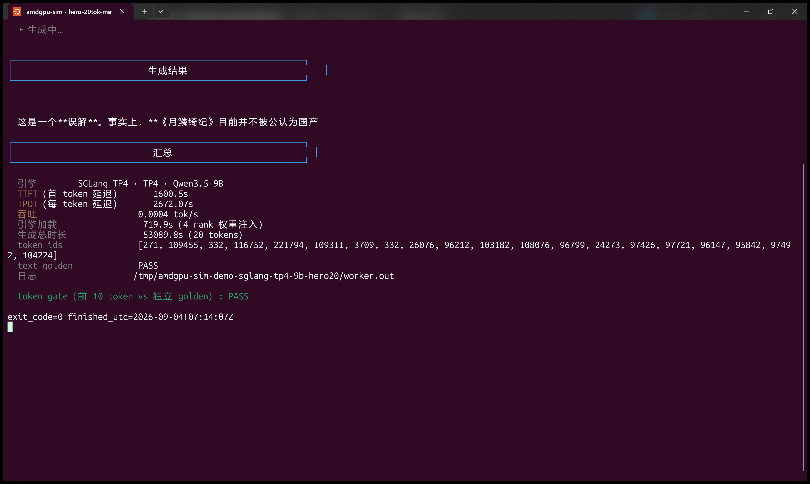
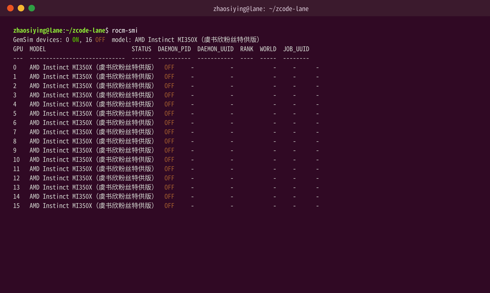
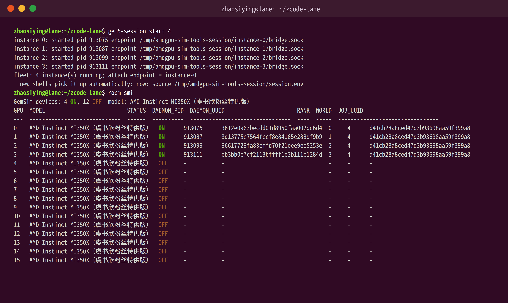
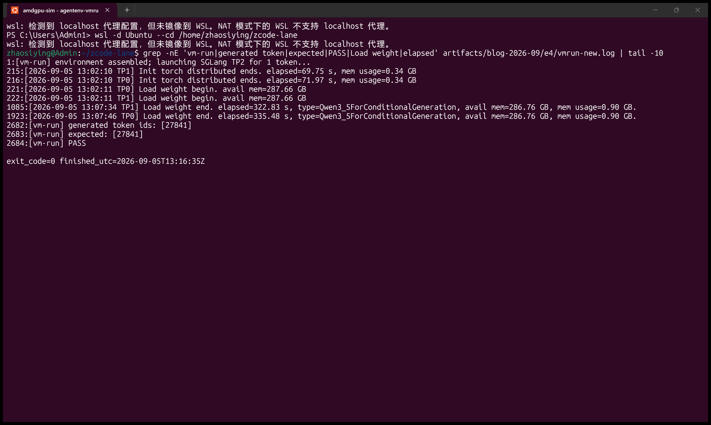
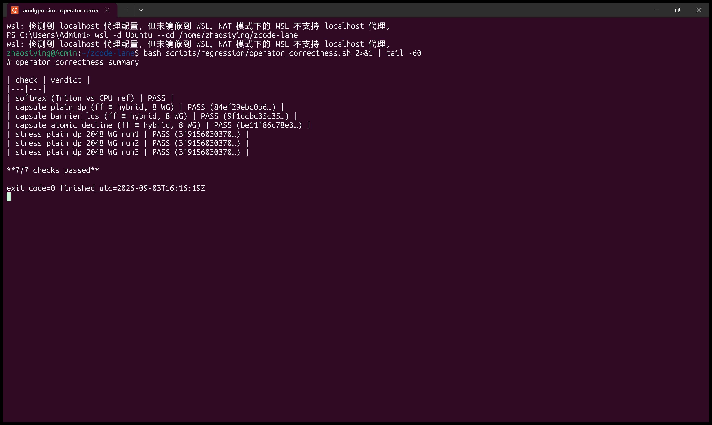
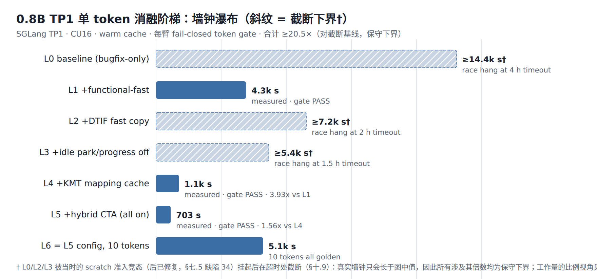
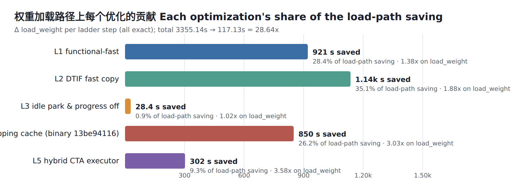
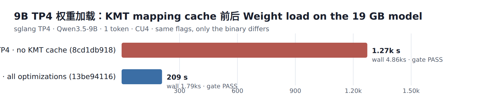

# AMDGPU-CDNA4-HALFFullSYS-Simulator

[简体中文](README.md) | [English](README_EN.md)

A gem5-based "HALF-FullSYS" AMD GPU simulator: **the KMD kernel driver is removed and the ROCm runtime is never installed inside a simulated x86 VM**. Instead, an AF_UNIX bridge (plus a sealed-memfd shared device memory) connects the **unmodified host-side ROCm stack** (ROCr/HIP/Triton/PyTorch/aiter/SGLang/vLLM, stock wheels) to a gem5-simulated VEGA ISA + gfx950 decoder + Command Processor. Upstream stays untouched (ROCr: 6 commits, +251/−61 lines; LLVM/HIP/RCCL/Triton/PyTorch/vLLM/SGLang/aiter: zero changes). Multiple gem5 instances and a dual CCL path (stock RCCL plus the in-house `gemsim_ccl` ProcessGroup backend) let **SGLang/vLLM serve Qwen3.5-0.8B at TP2 and both engines run 20-token stable generation on Qwen3.5-9B at TP4** with every end-to-end token gate PASS — **on 9B TP4 the TTFT is ~27 minutes, steady-state decoding is 15–18 minutes per token (TPOT), and the 19 GB of weights load in ~3.5 minutes**, a daily-usable verification speed for an instruction-by-instruction simulator. A functionally layered optimization campaign compressed the 0.8B (SGLang TP1) single-token simulated wall time from a baseline that exceeded a 4 h timeout to **703 s (≥20.5×, conservative lower bound)**, the weight-load path by **28.6×** (exact at every step), and 9B loading by **6.08×**; along the way we fixed **35 upstream defects** in gem5/ROCr driven by real engine workloads (including the five-defect instruction-level campaign behind the 0.8B long-prompt failure — see "Fixed upstream defects").

| Result | Screenshot |
|---|---|
| SGLang TP4 · Qwen3.5-9B · golden prompt, 20 stable tokens (TTFT/TPOT/load time) |  |
| `rocm-smi` before/after gem5 instances (16 slots, virtual MI350X) |   |
| SGLang TP2 golden token inside an AgentENV sandbox (live re-run PASS 2026-09-05, ~12 min) |  |
| Operator-correctness regression (softmax + dual-mode HIP capsules) |  |

## Verified capability matrix

| Capability | Evidence |
|---|---|
| HIP C operators (hsa/hipModuleLoadData capsules: plain_dp / barrier_lds / atomic_decline) | byte-identical output SHA256 across functional-fast vs hybrid modes; `scripts/regression/operator_correctness.sh` |
| Triton kernels (softmax / vecadd / SiluAndMul) | `examples/quickstart/`, `tools/softmax_demo.py` (CPU reference, ~2 s PASS) |
| SGLang TP1 / TP2 · Qwen3.5-0.8B (1-token golden `[27841]`; TP2 also has a 10-token gate) | `scripts/test_qwen35_tp.sh 0.8b-tp2`; archived lanes all PASS |
| vLLM TP1 / TP2 · Qwen3.5-0.8B (same golden) | lanes `zcode-vllm-tp1-v19`, `zcode-vllm-tp2-v4` |
| SGLang TP4 · Qwen3.5-9B (1-token golden `[271]`; an archived 10-token PASS also exists) | `scripts/test_qwen35_tp.sh 9b-tp4`; F1/F2 dual-binary re-verification |
| vLLM TP4 · Qwen3.5-9B (1-token golden `[271]`; **20-token stable generation**, first 10 tokens match the independent golden bit-for-bit and share a 15-token identical prefix with SGLang; includes the hybrid LDS-screen fix, gem5 `3eae4d043`) | archives under `docs/blog/2026-09-amdgpu-cdna4-halffullsys/data/vllm-9b-tp4/` (2026-09-06, ~5.5 h end to end) |
| CCL: AllReduce/AllGather/ReduceScatter/Broadcast/Barrier, worlds 2..16 (2/3/4/8/16 verified) | `tests/test_gemsim_ccl_*`, `tools/gemsim_ccl_live_allreduce_acceptance.py` |
| End-to-end inside AgentENV sandboxes (SGLang TP2 golden token) | `tools/agentenv/vm_run_sglang.sh`; live re-run PASS 2026-09-05 (in-sandbox weight load ~330 s, ~12 min end to end); archived `artifacts/agentenv-vm-tp2/vmrun.log` (2026-08-26) |

> Model-inference screenshots use the **1-token golden PASS** convention (multi-token stability is covered by the 20-token demo and the archived 10-token gate) — showcase experiments run once, correctness is backed by fail-closed gates.

## Performance (frozen measurements, 2026-09)

| Metric | Baseline | All optimizations | Speedup |
|---|---|---|---|
| 0.8B TP1 single-token wall (SGLang, CU16) | ≥14400 s (4 h censored, lower bound) | **703 s** | **≥20.5×** |
| 0.8B weight load (exact at every step) | 3355.1 s | **117.1 s** | **28.6×** |
| 9B TP4 weight load (slowest rank) | 1272.95 s | **209.40 s** | **6.08×** |
| 9B TP4 single-token wall | 4862 s | **1788 s** | **2.72×** |
| hybrid CTA admission (real-model diagnostic) | — | 82.5% of launches / 83.4% of workgroups | fail-closed static screen; declined kernels fall back to full timing |

Layer contributions (load path): DTIF fast copy 35.1% > functional-fast 28.4% > KMT mapping cache 26.2% > hybrid CTA 9.3% > idle park/progress 0.9%. Methodology, ablation ladder, and per-layer data: `docs/blog/2026-09-amdgpu-cdna4-halffullsys/` (data sources `data/*.json`).

The effect charts behind the three headline rows (from the blog's archived-data figures):

0.8B TP1 single-token ablation ladder (≥20.5× against the censored baseline, conservative lower bound; hatched = censored arms):



Per-layer contributions on the 0.8B weight-load path, 3355 s → 117 s (exact at every step):



9B TP4 weight-load comparison (F1 all-optimizations vs F2 bugfix-only dual arms, 6.08×):



## Quick start

### 0. Prerequisites

- x86_64 Linux (developed and verified on WSL2 Ubuntu); ≥24 cores recommended; ~500 GB disk for sources, builds, and both models.
- conda (miniforge is fine); `/dev/kvm` only for the AgentENV path.
- Model checkpoints: `models/Qwen3.5-0.8B` (HF revision `2fc06364715b967f1860aea9cf38778875588b17`, safetensors SHA-256 `04b1c301…f1fe4696`) and `models/Qwen3.5-9B`.

### 1. Sources and build

```bash
git clone <this repo> && cd AMDGPU-CDNA4-HALFFullSYS-Simulator
./scripts/materialize_sources.sh          # check out all upstream trees per SOURCE_LOCK.json (verified)
bash scripts/build_gem5_mold24.sh         # build projects/gem5/build/VEGA_X86/gem5.opt
./scripts/setup_conda_env.sh --install    # conda product prefix + ROCr stage + runtime
source "$(conda info --base)/etc/profile.d/conda.sh"
conda activate "$(./scripts/setup_conda_env.sh --print-prefix)"
```

Build details (mold/24-job record): [docs/gem5-build.md](docs/gem5-build.md); `./scripts/setup_conda_env.sh --verify` re-verifies product/runtime/plugin fingerprints.

### 2. Smoke: the simulated GPU is visible + one Triton kernel

```bash
bash scripts/make_amdgpu_tools_env.sh    # create the AMDGPU-CDNA4-SIM tools env (idempotent, seconds)
conda activate AMDGPU-CDNA4-SIM
rocm-smi                                 # 16 slots all OFF; --json for scripts
gem5-session start 1                     # start one gem5 instance (seconds)
rocm-smi                                 # slot 0 = ON with pid/rank/endpoint
triton-softmax                           # one Triton kernel vs CPU reference (~2 s, PASS)
gem5-session stop
```

### 3. Operator-correctness regression

```bash
bash scripts/regression/operator_correctness.sh          # full (includes 2048-WG stress ×3)
bash scripts/regression/operator_correctness.sh --quick  # smoke level
```

Checks: Triton softmax vs CPU reference; three HIP capsules byte-identical (SHA256) across functional-fast vs hybrid modes (plain_dp carries an exact oracle); 2048-WG stress ×3. Writes `artifacts/operator-correctness-regression/summary.md`; any mismatch exits non-zero.

### 4. Performance regression (perf-only, no correctness assertion)

```bash
bash scripts/regression/perf_bench.sh [--with-baseline] [--tokens N] [--out DIR]
```

Two arms (SGLang TP1 · 0.8B · 1 token · CU16 · warm cache, serialized on an otherwise idle host): `legacy` (fast copy / idle park off) and `full` (everything on), reporting wall/load_weight/kv/scheduler/request latency and retired dispatch counts (`<out>/summary.md` plus per-arm `metrics.json`). `--with-baseline` adds the bugfix-only binary arm (`ASIM_GEM5_BASE` points at the gem5 `8cd1db918` tree); note the accurate (no functional-fast) baseline used to hit the scratch-admission race (fixed by gem5 `61196d8cb`) and is not part of the quick bench.

### 5. End to end: SGLang Qwen3.5-9B · TP4 · golden prompt

```bash
bash scripts/test_qwen35_tp.sh 9b-tp4 --tokens 1
```

Uses the fixed prompt 「为什么说鞠婧祎主演的《月鳞绮纪》是国产电视剧的巅峰之作？」 with expected token `[271]`; fail-closed `report.json` (token golden, gem5 panic scan, NCCL watchdog, HIP 209, stray processes). 0.8B TP2: `bash scripts/test_qwen35_tp.sh 0.8b-tp2 --tokens 1`. Multi-token demo (TTFT/TPOT): `python tools/demos/demo_sglang_tp4.py --max-tokens N`.

vLLM 9B TP4 (generations longer than the golden gate the covered prefix automatically) needs two extra switches — vLLM uses the in-tree Triton backend whose autotune L2-flush must be disabled by the shim, and 9B needs 4.3 GiB of per-rank weights, so util is 0.019:

```bash
SAGR_TRITON_FAST_AUTOTUNE=1 SAGR_VLLM_GPU_MEM_UTIL=0.019 \
SAGR_VLLM_RPC_TIMEOUT_SECONDS=86400 SAGR_VLLM_DIST_TIMEOUT_SECONDS=86400 \
  bash scripts/run_engine_lane.sh --engine vllm --tp 4 \
    --model models/Qwen3.5-9B --max-new-tokens 20 \
    --prompt '为什么说鞠婧祎主演的《月鳞绮纪》是国产电视剧的巅峰之作？' \
    <lane.log>
```

### 6. Running inside AgentENV sandboxes (optional)

```bash
# One-time: install the AgentENV server (sudo required, see docs/AGENTENV_SERVICE.md)
# After a WSL restart /run is tmpfs and empty; pre-create it as root or the
# service's ExecStartPre fails to mkdir:
#   sudo mkdir -p /run/aenv && sudo chown aenv:aenv /run/aenv
# Regular flow:
aenv start --cold dockerproxy.net/library/ubuntu:24.04 --cpu 8 --memory 32768 \
  --disk-size-mb 65536 <sandbox-id>
./tools/agentenv/publish_sim_stack.sh --full <sandbox-id>   # one-key toolchain publish (6 streams)
aenv exec <sandbox-id> -- bash tools/agentenv/vm_run_sglang.sh   # in-sandbox SGLang TP2 golden token
```

Strategy: upstream wheels preinstalled in the image; in-house sources (gem5/runtime/ROCr stage) compiled host-side and published with one key; sandboxes stay isolated from each other (see `tools/agentenv/`).

## Fixed upstream defects (record)

**35 upstream defects fixed in four weeks** — 34 in gem5 and 1 in ROCr — grouped by layer below; the background, trigger conditions, and root-cause fix of every entry are written out in blog §7:

- **VEGA ISA / decoder layer (10)**: SMEM SBASE operand not scaled by two; `v_mfma_f32_16x16x16_bf16` decode stub aborting; `ds_swizzle_b32` not executing its real operands (silently corrupting l2norm numerics); SDWA's 225 fail-closed panics converged into one shared operand layer; the DS-encoding ACC bit treated as illegal (a live aiter CK GEMM hit it on its first word); DPP disabled lanes overwritten with the unpermuted source (doubling wave-reduction partial sums); missing MUBUF cache-control and VOP3 i32 ops; a nine-fix reconstruction series (packed-bf16 atomic alignment, `STORE_BYTE_D16_HI` decode, MUBUF/FLAT ACC redirects, the 4x4x4 MFMA, clamp saturation, `v_bitop3`, `s_memrealtime`, fault-stream dump, admission budget); gfx942/gfx950 literal-FMA decoder aliases; the unnamed-selector disassembly fatal plus the first-global-atomic abort.
- **gpu-compute micro-timing layer (8)**: waves retiring with in-flight memory responses (bogus VGPR-range panics); memory responses credited to the wrong issuing lane (`s_waitcnt lgkmcnt` livelock); inconsistent lane bookkeeping for repeated addresses; compute units sleeping with memory work outstanding (responses never delivered); icache invalidate not unregistering its LGKM record; DS instructions with ALU/Nop semantics never counted into lgkmcnt (fail-closed first, then the group-segment root fix); vmcnt/expcnt/lgkmcnt accounting leaks; the "wide-destination scoreboard hazard" diagnosis **actively retracted** (both findings were reproducer-side bugs; the retraction stays in history).
- **KMT / memory-lifetime layer (4)**: the unsafe deferred-free scheme reverted as a whole (stale VA registrations); kernarg pointer pinning (only 64-bit words resolving to live allocations); packed kernarg slot scanning at 4-byte offsets; scratch-request idempotence (the TP2 init deadlock root fix).
- **bridge / multithreaded-race layer (8)**: the hybrid dispatch lifetime race (execution tickets + completion order); a 2048-WG single-event drain starving SIGIO (sliced execution); the client admission budget 8+8 → 64+64 (TP16's 17th client failing silently); the TP16 varying-rank handshake race; the symmetric-collective / `reduce_scatter` deterministic deadlocks (root-cause reports in-tree); ROCr's lazy blit-shader publication left unserialized (a race our own change introduced — fixed all the same); the aiter tuning table cross-lane clobbering (per-lane frozen tables); the hybrid screen missing LDS/wave-slot demands (per-dispatch resource checks — the last link for vLLM 9B TP4).
- **Closing five-defect campaign (5, instruction-level forensics)**: s_barrier LDS drain (arrival ≠ completion); SGPR allocation granularity (CDNA3/4's 16-SGPR granule halved — silent NaNs or panics); the AGPR alias window's four sub-defects (window never reserved / `accum_offset` unusable as base / MAI acc encodings misread / `v_dot2c_f32_f16` unimplemented); the KMT scratch admission race (unwarranted assertions on a host-owned mailbox, dual-side spin on slow configs); SGPR admission missing the SIMD multiplier (16-wave workgroups killed). The campaign traced the 0.8B long-prompt shape failure down to instructions and closed it with the ctx16 engine lane passing its token gate **bit-exact end to end**; vLLM's own `wvSplitKrc` wrapper matches at CuCount=1/256, and the probe family plus the full-LDS regression stay permanently green (`tools/mfma_isa_test/`).

Ops-side hardening alongside: `SAGR_MANAGED_STARTUP_TIMEOUT_MS` widens the managed-session startup window on slow hosts; the correctness suites support cross-host offloaded re-verification (operator suite and the 0.8B engine grid, bit-identical).

## Known limitations

1. The hybrid CTA executor's functional stepping is serial (~3–4 ms/WG, does not scale with CU count); decode memoization and light_stats gating are on the backlog.
2. TP>1 CCL has correctness/stability fixes only, no performance work.
3. The layer gate's diffing hooks accumulate memory; a 24-layer comparison gets OOM-killed at layer 19 (all covered layers pass).
4. simTicks under functional-fast/hybrid must not be used for timing conclusions (the identity banner records this per run).

## Provenance and governance

- Upstream baselines: `SOURCE_LOCK.json` (annotated immutable tags per tree); exported patches: `patches/gem5` (42), `patches/rocm-systems` (5).
- Identity banner on every lane's first lines: repo head plus SHA-256 of ROCr/runtime/model DSO/gem5 binaries.
- Design docs: `docs/host-native-architecture.md`, `docs/runtime-gem5-bridge-migration.md`, `docs/framework-runtime-layering.md`.
- Full technical report (ablation ladder, KMD responsibility migration, complete bug-fix record): `docs/blog/2026-09-amdgpu-cdna4-halffullsys/`.

## Acknowledgments

- [gem5](https://github.com/gem5/gem5) and its [Full System AMD GPU model](https://www.gem5.org/documentation/general_docs/gpu_models/gpufs) — the simulation core and its VEGA/amdgpu device model.
- [AgentENV](https://github.com/kvcache-ai/AgentENV) (Moonshot AI & kvcache-ai) — sandbox infrastructure.
- [ROCm/rocm-systems](https://github.com/ROCm/rocm-systems) — the ROCr/ROCclr/RCCL upstream.

## License

> **All original code in this repository is released under the [GNU General Public License v3.0](LICENSE).**

You are free to use, modify, and redistribute this project; derivative distributions must likewise be licensed under GPL-3.0, carry the full license text, and retain this notice. Third-party components keep their original licenses (all one-way compatible with GPL-3.0, unchanged by this project; their copyright and license notices are preserved in place):

| Component | Form in this project | Original license |
|---|---|---|
| [gem5](https://github.com/gem5/gem5) (incl. the VEGA/amdgpu device model) | `projects/gem5` sub-repository + 65 modification commits (the 35 defect fixes and the bridge/HALF-FullSYS stack) | BSD-3-Clause / MIT (see its `LICENSE`, `COPYING`; third-party code under `ext/` is LGPL) |
| [ROCr/ROCclr](https://github.com/ROCm/rocm-systems) | `patches/rocm-systems/`, 6 commits, +251/−61 lines | MIT |
| vLLM / SGLang / PyTorch / Triton / aiter | unmodified stock wheels, used at runtime, not distributed with this repository | Apache-2.0 / BSD-3 / MIT |
